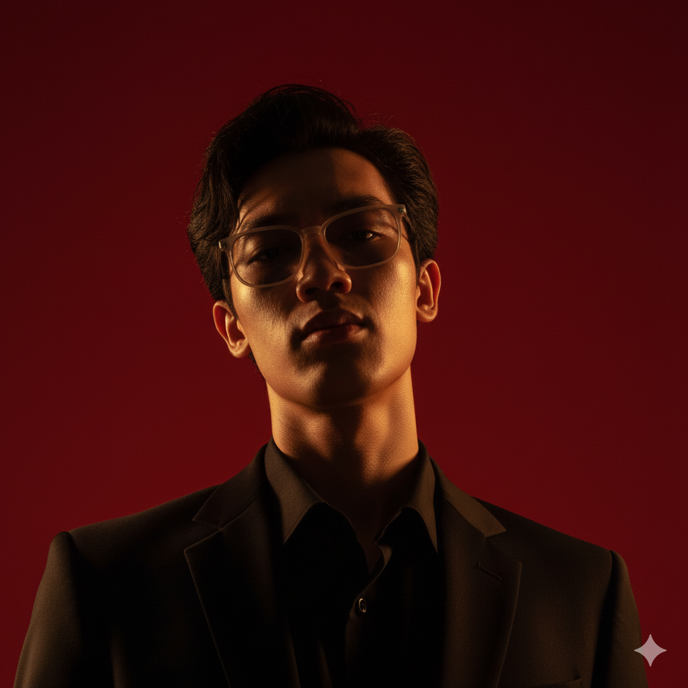

    
    <h1>Natkamon Huaihongthong</h1>
    <h3>🎮 Game Developer | 💻 Software Engineer</h3>

---

## About Me

**An ambitious developer** with hands-on experience in building **gameplay systems**, **procedural generation**, and **network-based features**. I aim for performance and efficient products, leveraging a strong foundation in **C, C++, Lua**, and system design principles.

*  **Location:** Thailand
*  **Currently Learning:** V, Rust, and Python.
*  **Ask Me About:** Game development! I'm also currently learning `raylib` for building games from the ground up.

---

## Skills & Technologies

### Programming Languages

### Tools & Software

### Operating & Embedded Systems

---

## My GitHub Activity

### Top Repositories

    
    

  ---

---

---

## Connect with Me

* <a href="https://www.github.com/Draconic02171" target="_blank" rel="noreferrer"> 
    <picture> 
        <source media="(prefers-color-scheme: dark)" srcset="https://raw.githubusercontent.com/danielcranney/readme-generator/main/public/icons/socials/github-dark.svg" /> 
        <source media="(prefers-color-scheme: light)" srcset="https://raw.githubusercontent.com/danielcranney/readme-generator/main/public/icons/socials/github.svg" /> 
         
    </picture> 
</a> **GitHub** | Check out my repositories and open-source contributions.

* <a href="https://www.youtube.com/@draconic_lilly" target="_blank" rel="noreferrer"> 
    <picture> 
        <source media="(prefers-color-scheme: dark)" srcset="https://raw.githubusercontent.com/danielcranney/readme-generator/main/public/icons/socials/youtube-dark.svg" /> 
        <source media="(prefers-color-scheme: light)" srcset="https://raw.githubusercontent.com/danielcranney/readme-generator/main/public/icons/socials/youtube.svg" /> 
         
    </picture> 
</a> **YouTube** | See my projects in action and watch development logs.

* <a href="https://discord.com/users/draconic_nate" target="_blank" rel="noreferrer"> 
    <picture> 
        <source media="(prefers-color-scheme: dark)" srcset="https://raw.githubusercontent.com/danielcranney/readme-generator/main/public/icons/socials/discord-dark.svg" /> 
        <source media="(prefers-color-scheme: light)" srcset="https://raw.githubusercontent.com/danielcranney/readme-generator/main/public/icons/socials/discord.svg" /> 
         
    </picture> 
</a> **Discord** | Send me a direct message or connect with me there!

---
